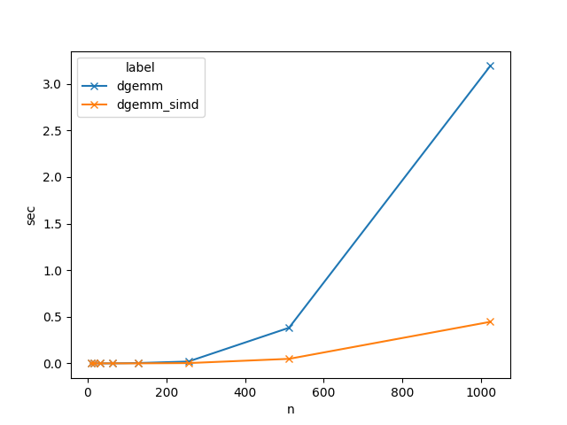
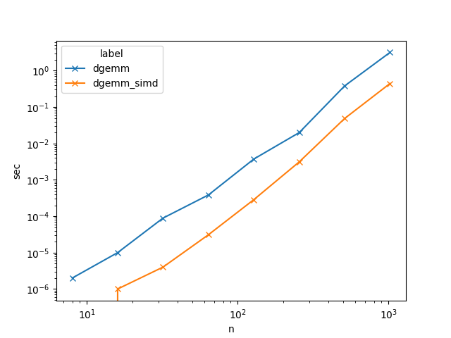

# GEMM SIMD Benchmark

Benchmark for GEMM (General Matrix Multiplication) with AVX-512 SIMD acceleration.

## Build

- Build shared libraries

```
make lib
```

This build step compiles `libdgemm.so` in `lib/` directory, which contains two functions:

```c
// Double-precision general matrix multiplication
void dgemm(int m, int n, int k, double *A, double *B, double *C);
void dgemm_simd(int m, int n, int k, double *A, double *B, double *C);
```

`dgemm()` computes matrix multiplication of `A` (`m` x `k`) and `B` (`k` x `n`) into `C` (`m` x `n`).
`dgemm_simd()` is AVX-512 accelerated version of `dgemm()`.

## Test

```
make test
```

runs small matrix multiplication tests in `testcases/` directories.

This test only checks `dgemm()` implementation (not `dgemm_simd()`) implementation, because `dgemm_simd()` currently only support matrices with 64-byte alignment at the start of each row.

```
make validate
```

runs validation which checks the difference of `dgemm()` and `dgemm_simd()` are negligible (probably no difference).

This test runs `N` x `N` matrix multiplications for `N` = 8, 16, 32, ..., 1024 using both `dgemm()` and `dgemm_simd()` and checks difference between two results.

## Benchmark

```
make benchmark
```

runs benchmark for `dgemm()` and `dgemm_simd()` for square matrices with random double values `[0, 1)`.

## Benchmark Results

### Environment

- CPU: Intel(R) Xeon(R) Gold 6252 CPU @ 2.10GHz
- OS: Linux 5.15.0-97-generic
- Compiler: GCC 11.4.0

### Execution time

- Linear plot



- Loglog plot



### Speedups (raw)

`dgemm_simd()` speedup over `dgemm()`

```
Speedup:
n
8             inf
16      10.000000
32      22.250000
64      12.419355
128     13.059441
256      6.392113
512      7.856221
1024     7.158072
```

For `n = 8`, `dgemm_simd()` execution time was recorded as 0.0, so speedup result is "inf".
